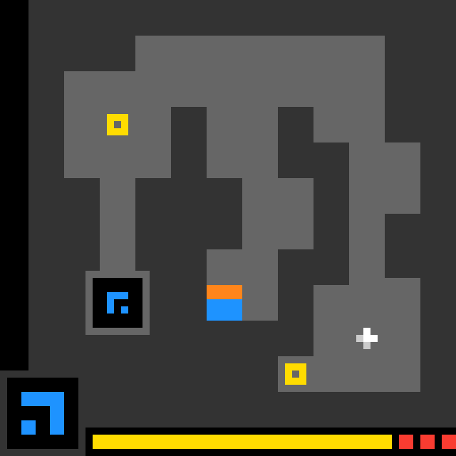

# UB-X: A Lightweight Parallel World-Model Agent for ARC-AGI-3

UB-X is an experimental offline agent for interactive ARC-AGI-3 environments. It combines exact-pixel perception, object and geometry tracking, competing executable mechanic hypotheses, an authoritative transition graph, sparse learned dynamics, and verified search.

The project explores a central question: can an agent learn the rules of an unfamiliar visual environment quickly enough to act purposefully, without relying on a game-specific controller?



## Project status

UB-X is an active research prototype, not a trained competition submission. The complete offline runtime and training foundation is implemented. Until a checkpoint is trained, `offline_ubx` uses its deterministic graph-and-information-gain bootstrap. The authenticated Codex CLI remains available only as a development teacher.

The repository currently includes:

- an object-centric visual perception pipeline;
- persistent JSON and Markdown scene memory;
- geometry, symmetry, rotation, reflection, and color-change analysis;
- adaptive single-step probing followed by guarded multi-action plans;
- bounded breadth-first search as a late-stage recovery mechanism;
- structured trace and screenshot capture for evaluation;
- an optional live viewer kept separate from the core worker.
- a 12-block, width-512 sparse world model with eight routed experts, top-2 routing, one shared expert, and eight-step action prediction;
- procedural mechanic-family generation with family-level holdouts;
- representation, imitation, on-policy distillation, and group-relative RL stages;
- Modal shard/training/export orchestration and sub-1GB INT8 artifact enforcement.

## How UB works

```text
ARC observation
      |
      v
Visual inventory -> semantic objects -> persistent scene model
      |                                      |
      +------------ change detection <-------+
                                             |
                                             v
                               planner -> guarded actions
                                             |
                                             v
                                      ARC environment
```

At the beginning of a level, UB performs three deliberate move-and-check probes. These establish how the player moves and which parts of the scene respond. Once the observed transition model is sufficiently stable, the planner can issue a logical batch of actions. Execution stops early when the result diverges from expectations, a meaningful visual event occurs, movement is blocked, or the level changes.

The agent treats empty space and large uniform regions as probable background while prioritizing distinctive objects and relationships. Repetition, containment, alignment, symmetry, rotation, reflection, scaling, and rare colors are used to identify likely players, collectibles, controls, clues, and goals. These interpretations remain hypotheses and are revised after interaction.

Breadth-first search is intentionally deferred until the level has been explored or the planner requests recovery. A separate higher-reasoning escalation is available only after repeated evidence of being stuck.

## Run locally

### Requirements

- Windows PowerShell
- Python 3.12 or compatible
- an installed and authenticated Codex CLI
- access to the ARC-AGI toolkit and game environments
- an ARC profile key stored locally in `.env2` or `.env2.txt`

Secrets and downloaded environment files are excluded from Git. The launcher reads the existing ARC key but never creates or prints one.

Install the Python dependencies in a virtual environment:

```powershell
python -m venv .venv
.\.venv\Scripts\python.exe -m pip install -r requirements-ub.txt
```

Run the offline deterministic bootstrap (no Codex/API planner):

```powershell
.\run_ub.ps1 -Game ls20 --planner offline_ubx --target-levels 1 --max-actions 40
```

Run the current Codex teacher harness:

```powershell
.\run_ub.ps1 -Game ls20 --target-levels 1 --max-actions 40
```

Run the game continuously with the live viewer:

```powershell
.\run_ub.ps1 -Game ls20
```

Use `-NoViewer` for a headless run. Use `--fresh-memory` to start with an empty object map rather than reusing knowledge from an earlier run.

Competition mode forces offline UB-X, ARC's competition operation mode, no Codex/Sol planner, and no viewer:

```powershell
.\run_ub.ps1 -Game ls20 --competition --model-path .\artifacts\ubx_int8.pt
```

## Train UB-X

Install training-only dependencies, generate immutable shards, and run a stage:

```powershell
.\.venv\Scripts\python.exe -m pip install -r requirements-ubx-train.txt
.\.venv\Scripts\python.exe -m ubx.dataset --output data\train_00000.npz --episodes 1000
.\.venv\Scripts\python.exe -m ubx.train --data-dir data --output-dir checkpoints --stage representation --steps 10000
```

Run the distributed pipeline with `modal run modal_ubx.py`. It generates shards in parallel, trains the four stages sequentially on L4, validates/exports on A100, and checkpoints to the `arc-ubx` Volume every 20 minutes.

## Outputs and observability

Each run writes reproducible artifacts beneath `ub_runs/<run>/`:

- `trace.jsonl`: decisions, actions, outcomes, and planner metadata;
- `object_map.json` and `object_map.md`: the durable semantic object model;
- `scene_inventory.*`: the exhaustive current pixel-component census;
- `scene_events.jsonl`: compact visual-change history;
- step screenshots and a final `summary.json`;
- `sol_escalation_step_*.json`: bounded evidence supplied during last-resort escalation.

The optional viewer in `devtools/` displays the latest frame, progress, active planner, confidence, and object table. It is read-only, is never imported by the worker, and can be removed without changing agent behavior.

## Why cloud compute matters

The next phase is to turn successful interactions and exact local search into training data for a specialized offline model. Cloud compute would support:

1. parallel rollout generation across many games and randomized states;
2. imitation learning from successful planner and search trajectories;
3. policy/value and transition-model training;
4. large held-out evaluations and controlled ablations;
5. model compression and CPU-oriented inference testing.

The initial target is a small grid-native network rather than a general-purpose language model. It will provide action priors, state-value estimates, and transition predictions to an adaptive search engine. This keeps the final system reproducible, inexpensive to evaluate, and independent of external APIs.

## Evaluation and ablation

```powershell
.\.venv\Scripts\python.exe -m unittest discover -s tests -v
.\.venv\Scripts\python.exe -m ubx.evaluate --engine graph_baseline --episodes-per-family 5 --output evaluations\graph.json
.\.venv\Scripts\python.exe -m ubx.evaluate --engine offline_ubx --model-path checkpoints\rl_final.pt --disable-neural-expert geometry --output evaluations\without_geometry.json
```

The evaluator reports completion by mechanic family, held-out-family success, planning latency, repeated states, and repeated dead actions. Expert disabling supports the required specialist ablations.

## Competition boundary

Kaggle evaluation runs without internet access and enforces ARC competition mode. The present Codex-backed planner is therefore a development and data-generation harness only. A valid submission must package its planner and learned weights locally, omit `devtools/`, create a single competition scorecard, and make only one `make()` call per environment.

## Repository guide

| Path | Purpose |
|---|---|
| `ub_worker.py` | Environment loop, planner selection, competition mode, action verification, and artifacts |
| `ubx/` | Stable schemas, multiview perception, hypotheses, graph memory, sparse model, search, gym, training, evaluation, and export |
| `modal_ubx.py` | Parallel Modal data generation and staged GPU pipeline |
| `ub_scene.py` | Pixel inventory, object tracking, geometry, and scene changes |
| `ub.py` | Planner schemas and Codex CLI integration |
| `ub_object_map.py` | Persistent semantic object memory |
| `ub_bfs.py` | Bounded local search used for recovery and research |
| `observation_prompt.json` | Human-inspired reasoning policy and output contract |
| `devtools/` | Optional live visualization tools |

## Responsible use

Do not commit ARC keys, API credentials, downloaded environment packages, or private run data. The included `.gitignore` excludes the expected local secret and artifact paths.
